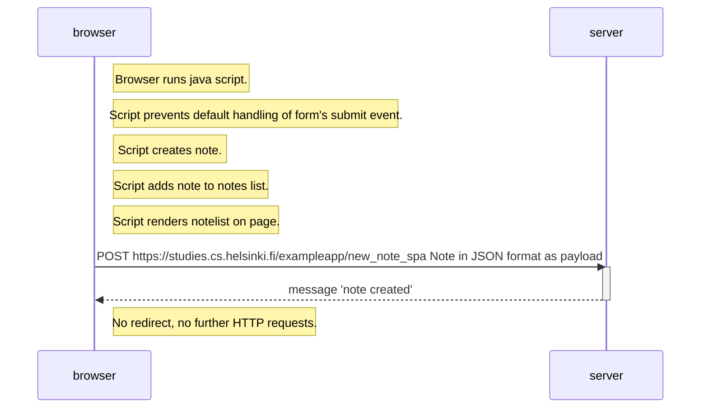

```mermaid

sequenceDiagram
    participant browser
    participant server

    Note right of browser: Browser runs java script.
    Note right of browser: Script prevents default handling of form's submit event.
    Note right of browser: Script creates note.
    Note right of browser: Script adds note to notes list.
    Note right of browser: Script renders notelist on page.

    browser->>server: POST https://studies.cs.helsinki.fi/exampleapp/new_note_spa Note in JSON format as payload
    activate server
    server-->>browser: message 'note created'
    deactivate server
    Note right of browser: No redirect, no further HTTP requests.
```